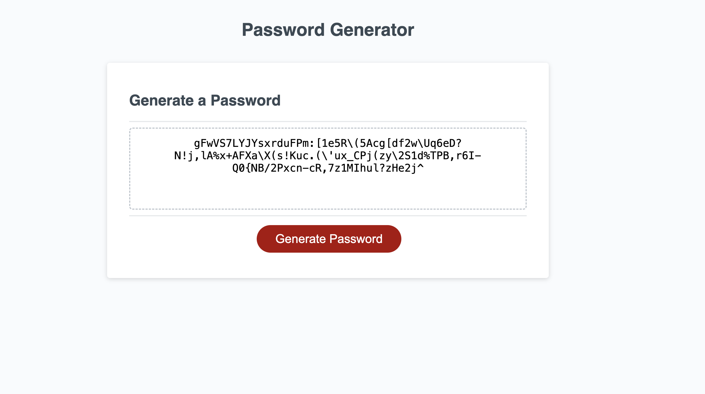

#  Password Generator

## Description
This project represents a webpage where you can generate random passwords for your accounts 
by choosing length and sets of characters

## Visuals

## Usage

Click on generate password and select the amount of characters you want the webApp to generate(8 to 128),
then, chose between different character sets like numbers or special and you will get your personal password generated, what's left to do is just to copy it and use it for your next accounts!!

## License

this page is protected by MIT Licence

